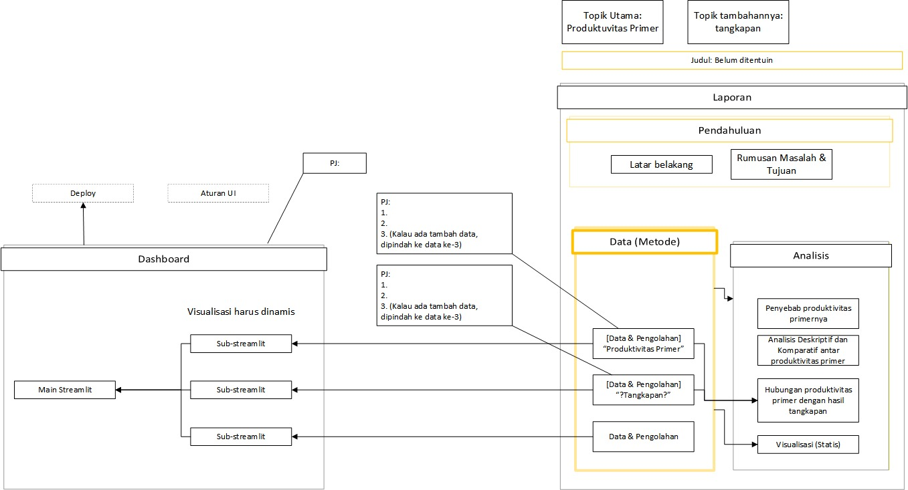

# Workflow

## Pengolahan Data

1. (Seharusnya cari tau dulu detail data yg dibutuhkan apa aja, tapi bodoh amat lah)
2. Menemukan cara dan melakukan perolehan data
3. Memastikan data tersebut yg kita butuhkan
4. Memahami tiap besaran dan satuan yang disediakan (agar paham cara mengolah dan menganalisisnya nanti)
5. Melakukan pra pengolahan (yg udah dipelajari kyk data cleaning, outlier, transformasi, bla bla a)
6. Menentukan dan membuat visualisasi yang tepat
7. Visualisasi statis untuk di laporan
8. <!--  -->

> [!Warning] Perhatikan lisensi/izin dari data yang digunakan

### Untuk data di dashboard

9.  Ekstrak skrip pengolahan ke dalam file py, dan sesuaikan file ipynb (kalau dari awal pakai ipynb).
10. Buat file py baru untuk ui2/elemen2 streamlit
    - Panggil skrip2 pengolahan data di sini
    - Jangan ada seluruh skrip pengolahan disini (hanya ada fungsinya saja)
11. Sesuaikan dan tampilkan data dengan streamlit
12. Gunakan visualisasi dinamis

## PJ dashboard

1. [X] Mencari tahu dan menerapkan streamlit ke cloud
2. [X] Branch repository
3. Menentukan lisensi dari projek dashboard
4. Menentukan nama domain dashboard
5. Bagikan brach repo ke anggota lain beserta template2nya
6. Sesuaikan dan tinjau aktivitas anggota lain
7. Kalau sudah selesai, remerge branch
8. Liat dashboard
9. metadata dashboard
