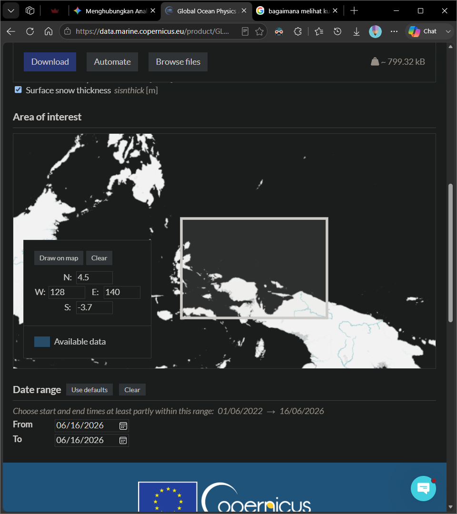

# Alurkerja

## Secara umum


1. Lokasi: 
2. Tahun 2020-2022 (Awal Desember 2019 sd. Akhir November 2022)
3. Data diolah sebagaimana yg telah diajarkan (kyk, mastiin data bersih dan valid)
4. Data dianalisis dengan **korelasi parsial metode spearman** 
    
    [Parsial korelasi yang dimaksud](https://en.wikipedia.org/wiki/Partial_correlation#Using_recursive_formula):
    
    $$
    r_{XY.Z}=
    \frac{r_{XY}-(r_{XZ}\times r_{YZ})}
    {\sqrt{(1-r_{XZ}^{2})(1-r_{YZ}^{2})}}
    $$

    CONTOH, pustaka pingouin:
    ```python
    pingouin.partial_corr(
        data=df, 
        x='suhu', 
        y='prodprim', 
        covar='salinitas', 
        method='spearman'
    ) 
    ```

    Penjelasan singkat tentang nilai dari perhitungan korelasi parsial:
    > Seperti koefisien korelasi, koefisien korelasi parsial memiliki nilai dalam rentang dari –1 hingga 1. 
    > Nilai –1 menunjukkan korelasi negatif sempurna dengan mengontrol beberapa variabel 
    > (yaitu, hubungan linier yang tepat di mana nilai yang lebih tinggi dari satu variabel dikaitkan dengan nilai yang lebih rendah dari variabel lainnya); 
    > nilai 1 menunjukkan hubungan linier positif sempurna, dan nilai 0 menunjukkan bahwa tidak ada hubungan linier.

5. setelah ada data memiliki nilai korelasi, buat kolom baru untuk melihat perbandingan kuat pengaruh dengan:

    $$\Delta |r_{(x,y)}| = |r_{\text{SST}(x,y)}| - |r_{\text{SSS}(x,y)}|$$

    **Keterangan Simbol:**
    *   $\Delta |r_{(x,y)}|$ : Nilai selisih koefisien korelasi (dominansi spasial) pada koordinat $(x,y)$.
    *   $|r_{\text{SST}(x,y)}|$ : Nilai mutlak koefisien korelasi parsial antara Suhu (*Sea Surface Temperature*) dan Produktivitas Primer pada koordinat $(x,y)$.
    *   $|r_{\text{SSS}(x,y)}|$ : Nilai mutlak koefisien korelasi parsial antara Salinitas (*Sea Surface Salinity*) dan Produktivitas Primer pada koordinat $(x,y)$.

    **Kriteria Penilaian Dominansi:**
    1. Jika $\Delta |r_{(x,y)}| > 0$ $\rightarrow$ **Suhu (SST) Menang Dominan** di lokasi tersebut.
    2. Jika $\Delta |r_{(x,y)}| < 0$ $\rightarrow$ **Salinitas (SSS) Menang Dominan** di lokasi tersebut.
    3. Jika $\Delta |r_{(x,y)}| \approx 0$ $\rightarrow$ Kedua variabel memiliki **kekuatan pengaruh yang setara**.


## Alur kerja analisis spasial

1. tiap pengolahan data sudah buat peta visualisasi masing2
2. perolehan dan pengolahan prodprim harus udah selesai
3. tim suhu dan salinitas terima data dari prodprim
4. buat peta heatmap korelasi parsial dengan metode spearman:
   1. antara suhu dengan prodprim, dan 
   2. salinitas dengan prodprim
5. Tim prodprim terima data dari suhu dan salinitas yg udah ada nilai korelasinya.
   1. 

### 📌 Ringkasan Alur Spasial yang Sudah Pasti (Data Per Tahun)

Nanti peta2 ini disusun di WORD LAPORAN sebagaimana di bawah berikut:

Untuk setiap tahunnya (misal: Tahun 2024), Anda akan menghasilkan 1 Panel Gambar berisi 6 peta yang disusun dalam 2 Baris:

- Baris 1 (Kondisi Lapangan Tahunan):
    - Peta 1: Rata-rata Suhu Permukaan Laut (Nilai asli: °C)
    - Peta 2: Rata-rata Produktivitas Primer (Nilai asli: mg/m³)
    - Peta 3: Rata-rata Salinitas (Nilai asli: PSU)
- Baris 2 (Hubungan Statistik Antar-Variabel):
    - Peta 4: Heatmap Korelasi Pearson Suhu vs Produktivitas Primer (Nilai r: -1 s.d 1)
    - Peta 5: Heatmap Korelasi Pearson Salinitas vs Produktivitas Primer (Nilai r: -1 s.d 1)

> [!NOTE] Catatan!
> Sebagai alternatif, peta prodprim bisa berdiri sendiri di baris pertama. 
> dan baris kedua berisi peta suhu dan salinitas, dst.

Dengan memisahkan visualisasi spasial ini per tahun, Anda dijamin bisa melihat di area mana saja pengaruh suhu atau salinitas mengontrol produktivitas primer, serta apakah lokasi area tersebut bergeser dari tahun ke tahun.

## Alur kerja Temporal 

> [!WARNING] PLAN B
> Kalau pakai rencana cadangan, tidak ada analisis temporal

1. ekstraksi data spasial yg hanya bernilai korelasi > 0,6 dan < -0,6 (hanya korelasi yg kuat saja)
2. buat grafik time series kronologis:
   - grafik garis menggunakan nilai rata-rata 1 musim (tiga bulan)
   - boxplot dibalik garis dengan alpha yg kecil menggunakan seluruh nilai 1 musim

    sehingga menghasilkan grafik 12 musim (3 tahun dikali 4)

### 📌 Ringkasan Alur Temporal yang Sudah Pasti (Data Per Tahun)

Nanti grafik2 ini disusun di WORD LAPORAN sebagaimana di bawah berikut:

Anda akan menghasilkan 1 Panel Gambar berisi 3 grafik yang disusun dalam 3 Baris:

- Baris 1: grafik boxplot time series produktivitas primer
- Baris 2: grafik boxplot time series suhu
- Baris 3: grafik boxplot time series salinitas